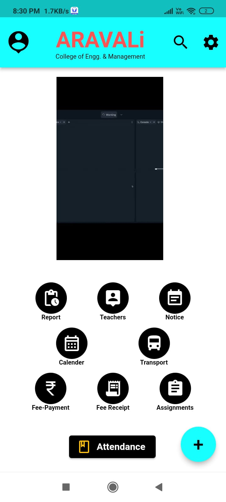

# Aravality_App

(project 7th semester)

<h2>Introduction</h2>
Android application for college with all the basic features for both the teachers as well as students so that they can remain in touch and can be informed about the things that are happening in college 

<h2>Technology/Languages used</h2>

 Flutter 

 App-Script 

 Firebase 

 Python flask 

  code is not provided but the basic pages will be shown in screen shots for preview  

<h2>Screen-Shots</h2>

  <h3>Basic-Pages</h3>
  
  
  
  <h3>Student-View</h3>
  <ol>
    <li>
      <h4>Dark-Theme</h4>
      
      
      
    </li>
    <li>
      <h4>Light-Theme</h4>
      
      
      
    </li>
  </ol>
  <h3>Service-Pages</h3>
  <ul>
    <li>
      <h5>Holidays</h5>
      
    </li>
    <li>
      <h5>Fee-payment</h5>
      
      
    </li>
  </ul>

<h2 align="center">Scan-to-Download</h2>

  

<footer align="right">
  <b><i>Thanks for visiting this page</i></b>
</footer>  
  
